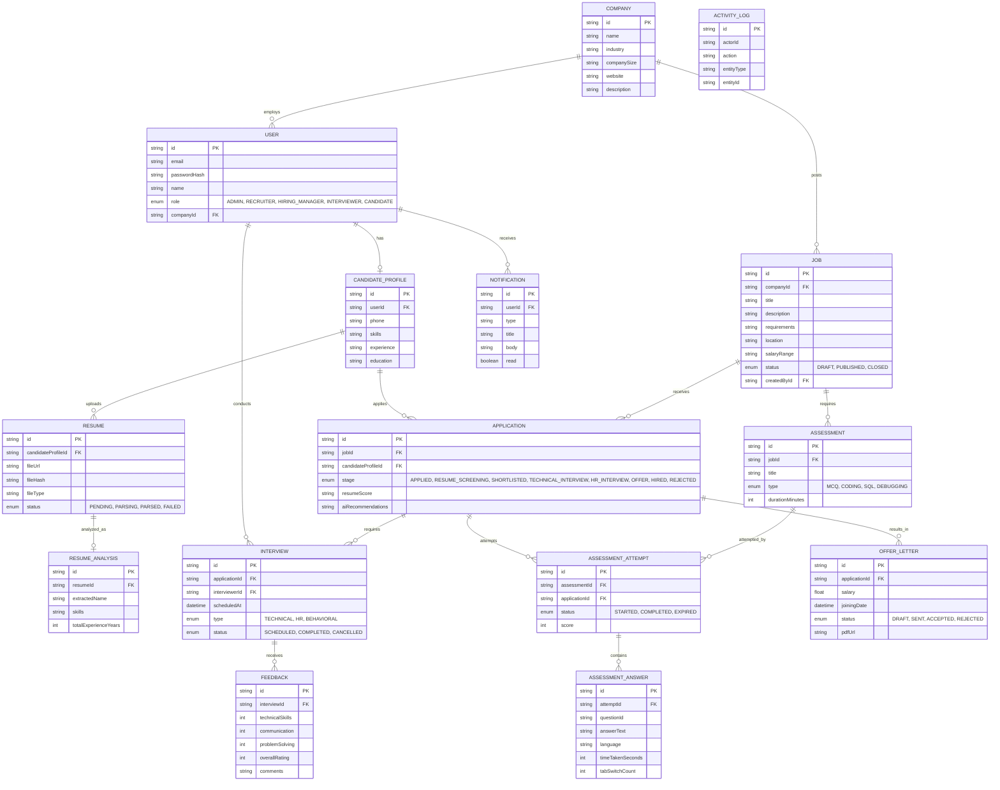

# Entity Relationship Diagram (ERD)

```mermaid
erDiagram
    USER {
        string id PK
        string email
        string passwordHash
        string name
        enum role "ADMIN, RECRUITER, HIRING_MANAGER, INTERVIEWER, CANDIDATE"
        string companyId FK
    }

    COMPANY {
        string id PK
        string name
        string industry
        string companySize
        string website
        string description
    }

    CANDIDATE_PROFILE {
        string id PK
        string userId FK
        string phone
        string skills
        string experience
        string education
    }

    JOB {
        string id PK
        string companyId FK
        string title
        string description
        string requirements
        string location
        string salaryRange
        enum status "DRAFT, PUBLISHED, CLOSED"
        string createdById FK
    }

    APPLICATION {
        string id PK
        string jobId FK
        string candidateProfileId FK
        enum stage "APPLIED, RESUME_SCREENING, SHORTLISTED, TECHNICAL_INTERVIEW, HR_INTERVIEW, OFFER, HIRED, REJECTED"
        string resumeScore
        string aiRecommendations
    }

    RESUME {
        string id PK
        string candidateProfileId FK
        string fileUrl
        string fileHash
        string fileType
        enum status "PENDING, PARSING, PARSED, FAILED"
    }

    RESUME_ANALYSIS {
        string id PK
        string resumeId FK
        string extractedName
        string skills
        int totalExperienceYears
    }

    INTERVIEW {
        string id PK
        string applicationId FK
        string interviewerId FK
        datetime scheduledAt
        enum type "TECHNICAL, HR, BEHAVIORAL"
        enum status "SCHEDULED, COMPLETED, CANCELLED"
    }

    FEEDBACK {
        string id PK
        string interviewId FK
        int technicalSkills
        int communication
        int problemSolving
        int overallRating
        string comments
    }

    ASSESSMENT {
        string id PK
        string jobId FK
        string title
        enum type "MCQ, CODING, SQL, DEBUGGING"
        int durationMinutes
    }

    ASSESSMENT_ATTEMPT {
        string id PK
        string assessmentId FK
        string applicationId FK
        enum status "STARTED, COMPLETED, EXPIRED"
        int score
    }

    ASSESSMENT_ANSWER {
        string id PK
        string attemptId FK
        string questionId
        string answerText
        string language
        int timeTakenSeconds
        int tabSwitchCount
    }

    OFFER_LETTER {
        string id PK
        string applicationId FK
        float salary
        datetime joiningDate
        enum status "DRAFT, SENT, ACCEPTED, REJECTED"
        string pdfUrl
    }

    NOTIFICATION {
        string id PK
        string userId FK
        string type
        string title
        string body
        boolean read
    }

    ACTIVITY_LOG {
        string id PK
        string actorId
        string action
        string entityType
        string entityId
    }

    USER ||--o| CANDIDATE_PROFILE : has
    COMPANY ||--o{ USER : employs
    COMPANY ||--o{ JOB : posts
    JOB ||--o{ APPLICATION : receives
    CANDIDATE_PROFILE ||--o{ APPLICATION : applies
    CANDIDATE_PROFILE ||--o{ RESUME : uploads
    RESUME ||--o| RESUME_ANALYSIS : analyzed_as
    APPLICATION ||--o{ INTERVIEW : requires
    USER ||--o{ INTERVIEW : conducts
    INTERVIEW ||--o{ FEEDBACK : receives
    JOB ||--o{ ASSESSMENT : requires
    ASSESSMENT ||--o{ ASSESSMENT_ATTEMPT : attempted_by
    APPLICATION ||--o{ ASSESSMENT_ATTEMPT : attempts
    ASSESSMENT_ATTEMPT ||--o{ ASSESSMENT_ANSWER : contains
    APPLICATION ||--o{ OFFER_LETTER : results_in
    USER ||--o{ NOTIFICATION : receives
```
